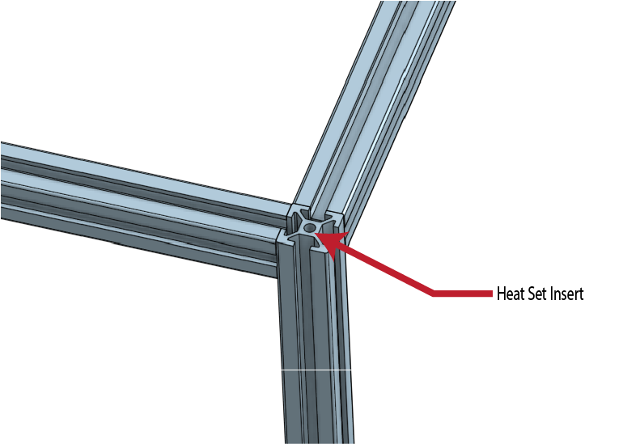

# V2_Frame_Skin  
Rounded Extrusion Covers to give your Voron 2.4 a sleek, smooth asthetic.  
%20v3.png)  
  
I Love my Voron 2.4r2. It sets a new bar for what a 3D Printer should be capable of.  
But, Ive never really liked the look of the Aluminum Extrusions that have been so commonly utilized for DIY CNC machines, printers, etc...  
And the only alternative seems to be the overly bulky quarter round extrusions like used in the DOOM project.  
So, I started from scratch with a few goals:  
 1 - As Low Profile as Possible. I have a 350 v2. I dont need that sucker being any bigger than it has to be ( or already is )  
 2 - Get rid of ALL sharp edges/corners/protrusions. Soon after I completed my build, I was walking past my newly built additive manufacturing beast of a printer and veered a bit too close. A corner caught just above my hip and left a nasty cut. Don't want to do that again.  
 3 - Must work with existing build. I didnt want to have to start swapping out extrusions, acrylic panels, or even have to disasemble anything gantry or below.  
 4 - As few visible screw heads as possible without overly complicating the installation.  
 5 - And, of course, it has to be a "printable" mod. ( All parts are printable besides a few screws and t-nuts. )  
   
 PLEASE NOTE:  
 These parts are not necessarily easy to print.  
 I found that printing them standing vertically worked the best for me. YMMV  
 Tolerances are tight. So calibration needs to be spot on. I tried printing some of them on my Ender3 and found its kinematics to be too sloppy.  
 Several of the parts will need supports. ( Hinge Body, Upper Corners, etc )  
 
 Individual STL's Have Arrived  
   
 M3x8 Screws & Hammerhead T-Nuts for Bottom Rails     
   
 M2x16 Screws for Hinges
   
   
 Hammer in M3 Heat Set Inserts in Top End of Aluminum Frame Extrusions. ( I used a bit of thread locker )  
   
   
 All pieces slide onto extrusions.  
   
 Thin double Sided Adhesive for hinges similar to 3M 468MP ( Not VHB. VHB is too thick )
 
